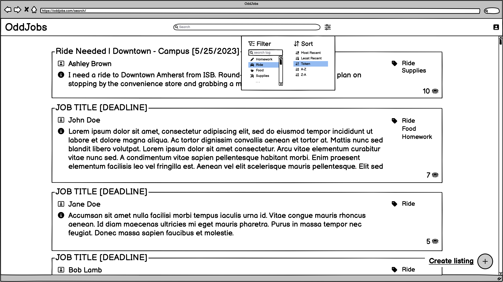
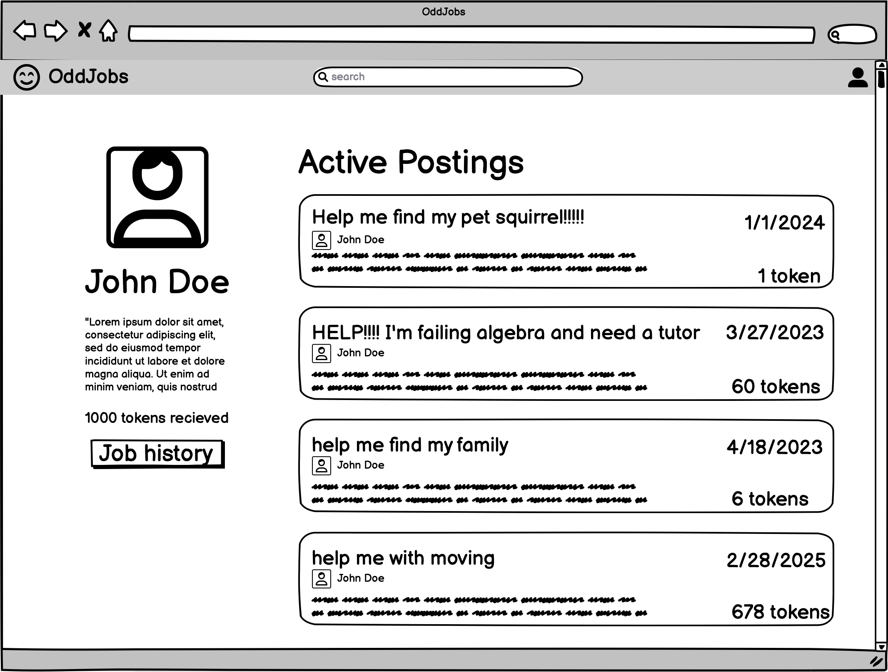
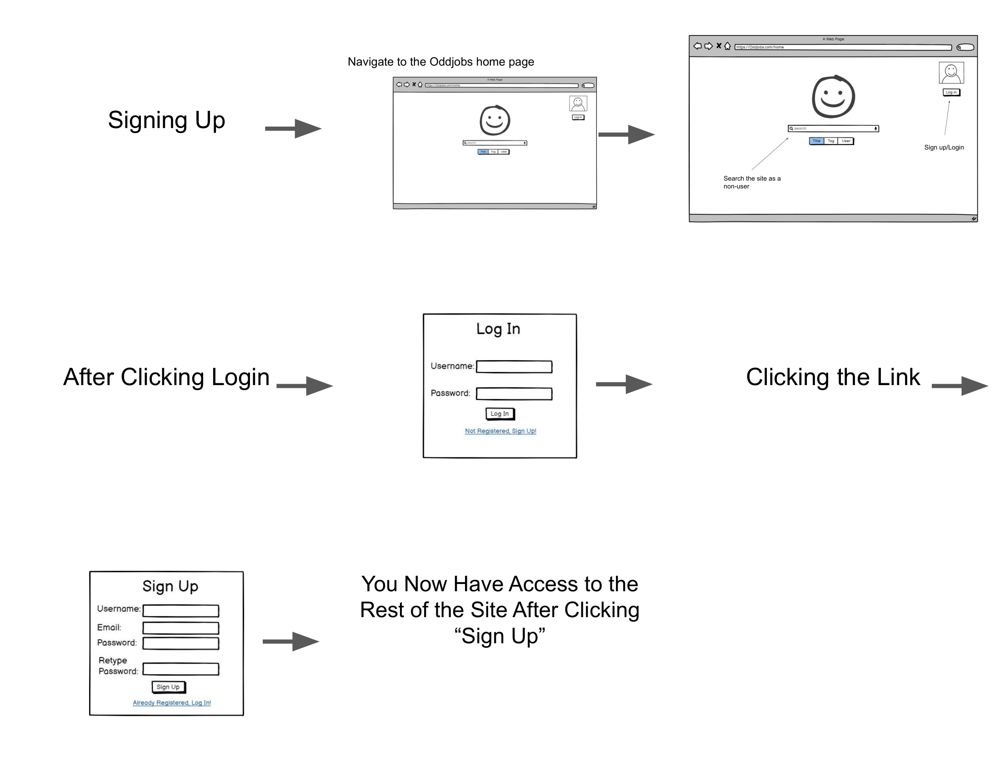
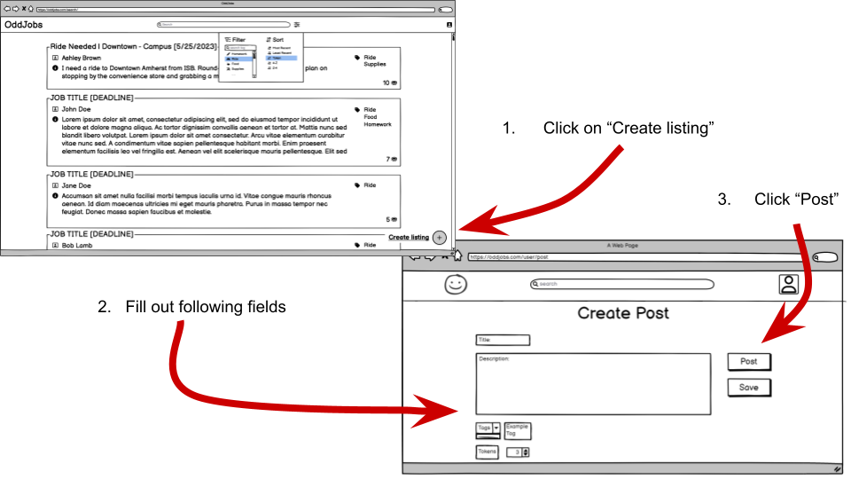

# UI Design

## Wireframe

### Search

Qui commodi beatae. Quaerat saepe tempora nisi labore ducimus corporis adipisci repellat nihil. Dolores est sed ratione consequatur est magnam cupiditate. Repellendus molestias qui doloribus. Deserunt quidem temporibus. Sunt hic laudantium vitae natus est.

### Profile

Qui commodi beatae. Quaerat saepe tempora nisi labore ducimus corporis adipisci repellat nihil. Dolores est sed ratione consequatur est magnam cupiditate. Repellendus molestias qui doloribus. Deserunt quidem temporibus. Sunt hic laudantium vitae natus est.

### Wireframe 3

Qui commodi beatae. Quaerat saepe tempora nisi labore ducimus corporis adipisci repellat nihil. Dolores est sed ratione consequatur est magnam cupiditate. Repellendus molestias qui doloribus. Deserunt quidem temporibus. Sunt hic laudantium vitae natus est.

### Wireframe 4

Qui commodi beatae. Quaerat saepe tempora nisi labore ducimus corporis adipisci repellat nihil. Dolores est sed ratione consequatur est magnam cupiditate. Repellendus molestias qui doloribus. Deserunt quidem temporibus. Sunt hic laudantium vitae natus est.

...

## Stories

### Story 1

The user will have navigated to the OddJobs homepage at this point. If the user wishes to search for jobs as a guest they can do so from this page. If the user wishes to log in or sign up, they can click the “Log In” button in the top right corner. After clicking this, they will be shown the “Log In” screen that will ask for a username and password. If the user wishes to sign up, they can hit the link below and instead be shown the “Sign Up” screen. After signing up, the user will then be directed to the search hub.

### Story 2

Blanditiis et esse ipsa soluta. Temporibus sunt possimus ut veritatis sint ut in quia eum. Omnis ea vel quae eligendi. Illo optio est doloremque autem. Sit ea dolorum architecto.
 
Fuga ea culpa eaque molestiae illo quod odio culpa. Et aut repellendus aut temporibus quae quia et. Quia consectetur quod est. Repellat animi amet quia velit.
 
Voluptatum accusantium dolores cumque sit accusamus. Eaque quia qui commodi rerum eos doloribus. Sint aliquam quae ut ut tempora pariatur qui.

### Story 3: Creating a post

Creating a post is simple in OddJobs. To begin, click the “+” icon at the bottom-right corner of the results page. You’ll be redirected to another page where you can fill out a form that contains the following fields: title, description, amount of tokens, deadline and any relevant tags. Tokens are the currency of OddJobs and this is your offer to the person who accepts your job. You can click on the save button to save your post for later. You can post your job by clicking the post button.

## HTML & CSS Mockup

Reiciendis velit dolorum voluptas earum. Rerum nobis accusantium laudantium minima incidunt. Magnam aut minus minus. Cumque unde voluptatibus soluta molestias perspiciatis aperiam accusantium laborum quo.

Natus est molestias est et autem non in. Laudantium consequatur facilis perferendis. Saepe similique sapiente rem ut. Laudantium natus voluptas delectus molestiae ab omnis quidem. Maxime cumque porro ea deleniti incidunt nihil cupiditate sunt. Nihil eaque porro nemo veritatis.

Ipsam architecto nulla ut dolor dolor sit mollitia deleniti minus. Velit quia iste.

## References

- [Link 1](https://example.com)
- [Link 2](https://example.com)
- [Link 3](https://example.com)