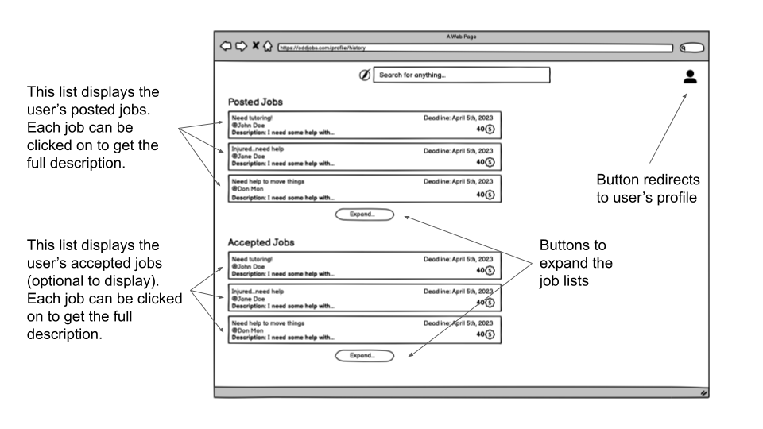

# UI Design

## Wireframe

### Log in

### Sign up

### Homepage

### Search

### Listing

### Posting

### Profile

### History

## Stories

### Story 1: Signing up or Logging into OddJobs
 
The user will have navigated to the OddJobs homepage at this point. If the user wishes to search for jobs as a guest they can do so from this page. If the user wishes to log in or sign up, they can click the “Log In” button in the top right corner. After clicking this, they will be shown the “Log In” screen that will ask for a username and password. If the user wishes to sign up, they can hit the link below and instead be shown the “Sign Up” screen. After signing up, the user will then be directed to the search hub.

### Story 2: Navigating through the jobs list and selecting a job
 
The search page will have all relevant and available job results based on the user’s search criteria displayed as a list. Each element/row in the list will correspond to one job, and it will contain the most important information of the job: the title, the user who posted it, the deadline, a short snippet of the description, and the number of tokens awarded for completing the job. Clicking on a list element will redirect the user to a page that contains the above mentioned details, but now including the full description. There will also be an “Accept” button on the lower right corner of this page. If the user wishes to accept the job, they can click on the button and that area of the page will change to a message saying that the job is accepted.

### Story 3: Creating a post
 
Creating a post is simple in OddJobs. To begin, click the “+” icon at the bottom-right corner of the results page. You’ll be redirected to another page where you can fill out a form that contains the following fields: title, description, amount of tokens, deadline and any relevant tags. Tokens are the currency of OddJobs and this is your offer to the person who accepts your job. You can click on the save button to save your post for later. You can post your job by clicking the post button.

### Story 4: Going to profile page
 
Every user that creates an account on OddJobs will have a profile page. Each profile page will have a profile picture beneath which is the name of the user, a bio (optional text a user can include to talk about themselves and their needs), the number of tokens accumulated so far, and a link named “Job History”. This link will redirect to a page that displays the user’s history of completed jobs. On the right side of all this information, there will be a list of jobs displayed similar to the list on the search page. This list contains the jobs the user has actively taken on. This list will contain only a few jobs. If the user has more active jobs, one can expand this list to scroll through the whole active job list.

### Story 5: Going to history page
 
This page displays a history list of jobs that the user has done (the user can decide whether they want to post this on their history page), and a list of the jobs they have posted. Both of these lists are similar to the list on the search page in that each element/row (an element represents a job) can be clicked on to redirect to a page that gives the full description of the job.

## HTML & CSS Mockup

- [Screenshots](/docs/milestone1.md)
- [HTML Mockups](/mockups)

## References

- [Balsamiq Wireframes](https://balsamiq.com/wireframes/)
- [Bootstrap](https://getbootstrap.com/)
- [TutorialRepublic Bootstrap Tutorial](https://www.tutorialrepublic.com/twitter-bootstrap-tutorial/)